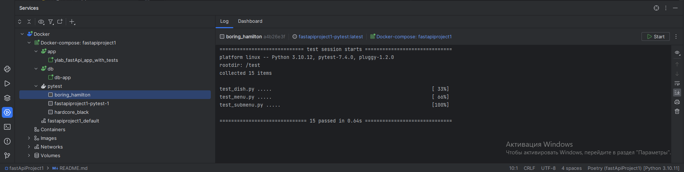
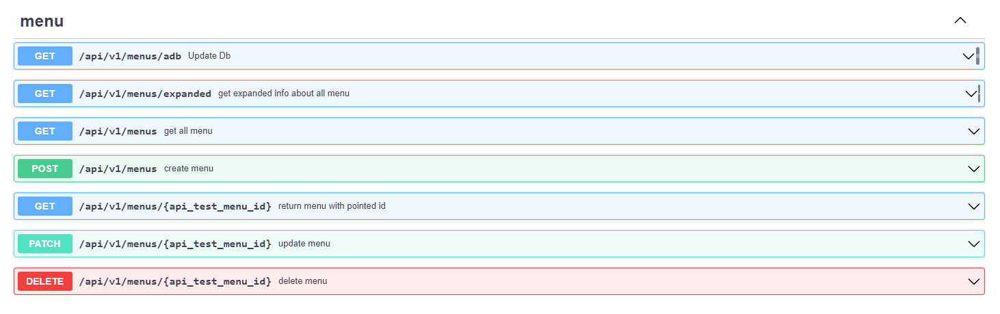

# fastApi_YLAB_project

# По четвертому заданию реализовано

- ### Приложение переписано на ассинхронное выполнение
- ### В проект добавлена фоновая задача с помощью Celery + RabbitMQ,  ***НОООО***
- ### Разделил docker-compose на
  - docker-compose-tests: Содержит приложение и тесты, для запуска используется
    ```sh
    docker-compose  -f docker-compose-test.yaml up -d   
    ```
  - docker-compose: Содержит приложение, celery и rabbitMQ
    ```sh
    docker-compose  -f docker-compose.yaml up -d   
    ```
  - Так же для наглядности работы, реализовал ручку апи которая делает тоже самое, она находится по пути
    ```
    /api/v1/menus/adb
    ```

- ### Реализован ендпоинт для вывода развернутой информации через один запрос к ORM
  - Блюда по акции записываются в бд с учётом скидки
- Инвалидация кеша вынесена в background task

# По третьему заданию реализовано

- Бизнеса логика вынесена в сервисный слой
- Реализовано кеширование GET запросов при помощи redis, при любом изменение кешированных данных их кеш очищается
- добавлены прекоммит хуки, код отформатирован в соответствие с требованиями линтеров
- код покрыт type hint'ами (что тоже было одним из требований линтеров)
- добавлен докер контейнер с редисом, изменена конфигурация докер файла, <strong><h3> изменен .env file</h3></strong>

> тесты линтеры проходят, докер работает))

# По второму задание реализовано

- Создание связки докер контейнеров, которые запускаюься по команде "docker-compose up -d"

1) О структуре контейнеров - создается 3 контейнера: 1.контейнер который хранит приложение, 2. контейнер с бд, 3.
   контейнер с минимальным содержимым необходимым для запуска тестов (он отрабатывает 1 раз и выключается, для
   повторного проведения используется команда "docker start").

- Написаны тесты для всех существующих эндпоинтов
- Сделано получение информации о кол-ве блюд и подменю через агрегатные запросы
- Написан тест реализующих сценарий подсчёта блюд и подменю в созданном меню

# Инструкция

# 1) Запуск с помощью docker-compose


## * Запуск приложения с celery + rabbitMQ и подделкой на админку
* ### Выполнить команду, что бы поднять контейнер с приложением
    ```sh
    docker-compose  -f docker-compose.yaml up -d   
    ```
* После можно зайти в контейнер celery-worker и посмотреть как происходит синхронизация excel и бд


## * Запуск приложения с тестами
 
 
* ### Выполнить команду, что бы поднять контейнер с приложением
    ```sh
    docker-compose  -f docker-compose-test.yaml up -d   
    ```
    <i>тесты автоматически начнут выполняться через 10 секунд</i> 
* ### Выполнить команду, что бы вручную повторно запустить тесты
    ```sh
    docker container start -a tests
    ```

## Пример:


## Пример использования docker-service для PyTest



# 2) Запуск без docker'а

* Подключить зависимости при помощи poetry

```sh
poetry  install
poetry update
```

* Запустить сервер средствами среды разработки или при помощи команды

~~~sh
 uvicorn python_code.main:app  --reload
~~~

* при запуске сервера бд очищается и создается заново

*
    1) Если необходимо изменить поведение, то измените функцию init_db по пути python_code.db


* пользоваться endpoint'ами
  
  
