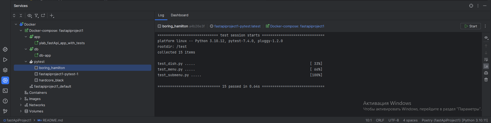

# fastApi_YLAB_project

# По второму задание реализовано
- Создание связки докер контейнеров, которые запускаюься по команде "docker-compose up -d"
1) О структуре контейнеров - создается 3 контейнера: 1.контейнер который хранит приложение, 2. контейнер с бд, 3. контейнер с минимальным содержимым необходимым для запуска тестов (он отрабатывает 1 раз и выключается, для повторного проведения используется команда "docker start").
- Написаны тесты для всех существующих эндпоинтов
- Сделано получение информации о кол-ве блюд и подменю через агрегатные запросы
- Написан тест реализующих сценарий подсчёта блюд и подменю в созданном меню

# Инструкция
# 1) Запуск с помощью docker-compose

* Выполнить команду "docker-compose up -d"
* Выполнить команду  "docker container start -a  tests"
## Пример:


`на самом деле тесты запускаются и после первой команды, но так как у меня возникли трудности с настройкой health_check
 то в первый раз тестируется ещё не поднятый сервер, при отдельном запуске образа с тестами проблема испаряется`
 

## Пример использования docker-service для PyTest


# 2) Запуск без docker'а 
* почему-то .env-non-dev  не отрабатывает В .yaml файле, поэтому придётся поработать с .env файлом
* Для запуска требуется отредактировать .env файл в основной дериктории проекта, указав следующие содержание
```
# PostgreSQL
POSTGRES_USER=postgres
POSTGRES_PASSWORD=1234
POSTGRES_DB=ylab

# load on pc withoit docker
# POSTGRES_SERVER=127.0.0.1
# load with docker
POSTGRES_SERVER=db

# test with docker
HOST_FOR_TEST=app
# test without docker
# HOST_FOR_TEST=127.0.0.1
```
* Подключить зависимости при помощи poetry
```
poetry  install
poetry update
```
* Запустить сервер средствами среды разработки или при помощи команды
~~~
 uvicorn python_code.main:app  --reload
~~~
* при запуске сервера бд очищается и создается заново

* 1) Если необходимо изменить поведение, то измените функцию  init_db по пути python_code.db 
* 2) В пути, по которому  тесты вызывают сервер указан путь для докера, что запустить их из pycharm  необходимо изменить 
.env файл 

```
вместо 
yield 'http://host.docker.internal:8000'
использовать 
yield 'http://localhost:8000'
```

* пользоваться endpoint'ами 


